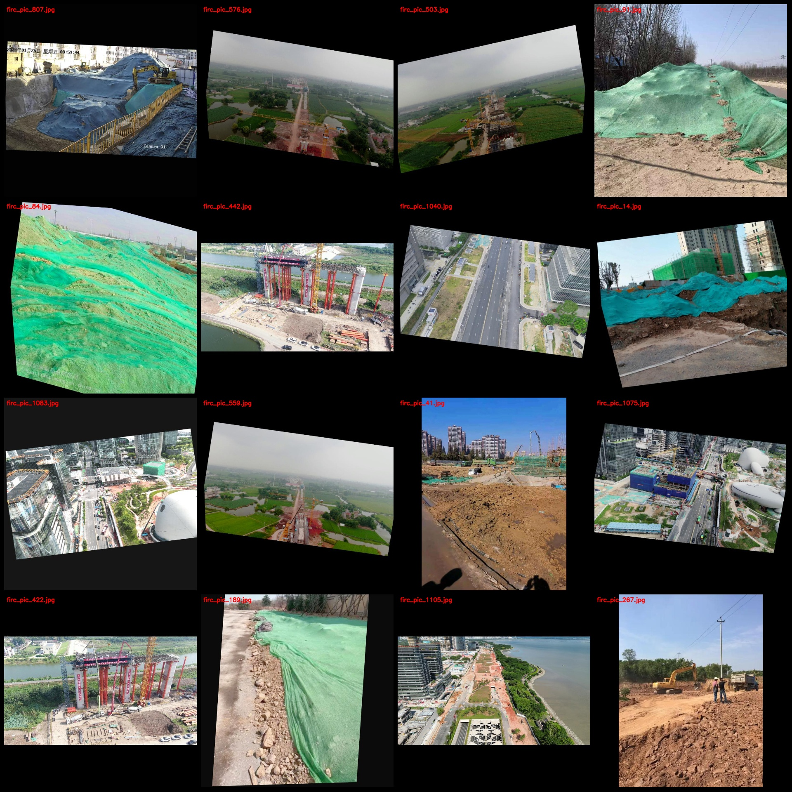
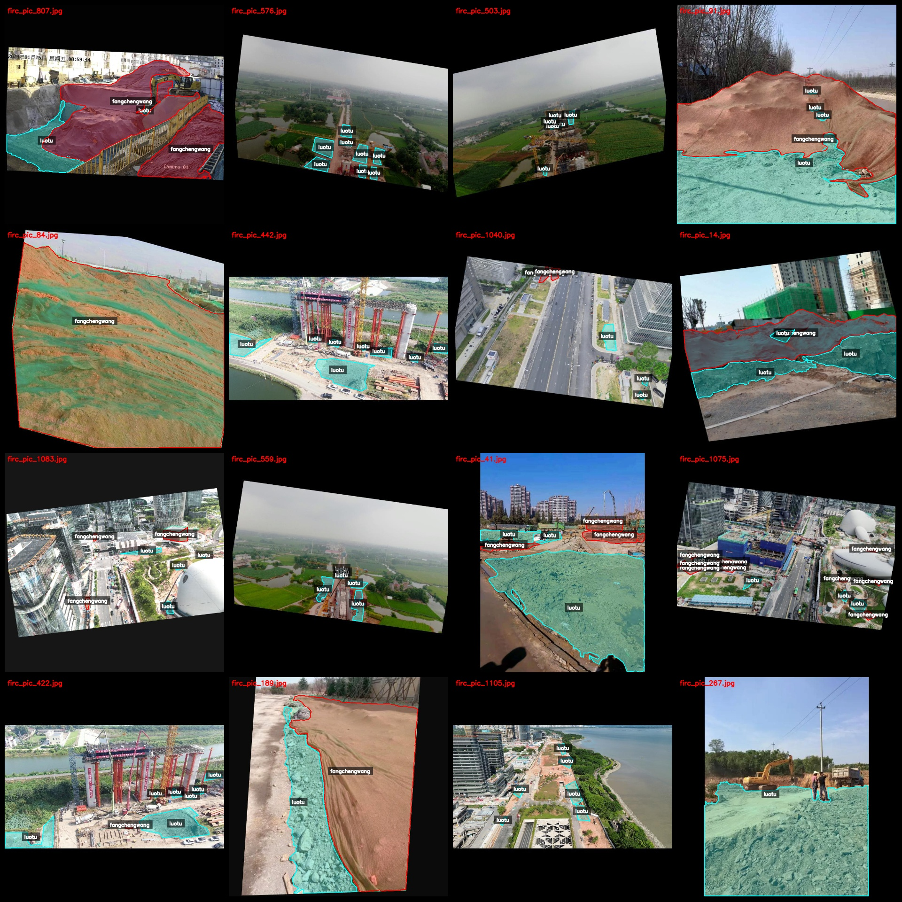
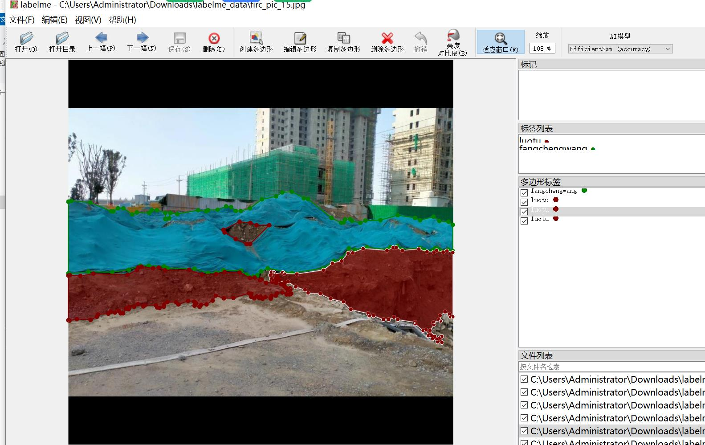

# Intelligent Construction Site Bare Soil and Dustnet Identification and Segmentation Data Set in LabelMe Format, 1119 Images of 2 Categories with Enhanced

Dataset format: LabelMe format (excluding mask files, only containing jpg images and corresponding json files)
Number of image files (number of jpg files): 1119
Number of annotations (json file count): 1119
Number of annotation categories: 2
Annotation category names: ["fangchengwang", "luotu"]
Each category's number of bounding boxes:
fangchengwang count = 1511
luotu count = 4174
Total bounding boxes: 5685
Annotation tool used: LabelMe version 5.5.0
Image resolution: 800x800
Annotation rules: Polygons are drawn for the categories
Important Notice: The dataset can be opened and edited using LabelMe, but the json dataset needs to be converted into a mask or Yolo format or COCO format for semantic segmentation or instance 
segmentation.
Special Remark: This dataset does not guarantee the accuracy of the models trained or the weight files.
Sample Image Preview:
Annotation example:
Randomly selected 16 images:
Annotation drawing results:
LabelMe editing image example:

## Images

Here is a pay link on Stripe ( https://buy.stripe.com/3cs8yP7sY87d0vu9AB ). Please contact me lonlonago@foxmail.com after funding $89, and I will send you a complete data files , thank you!

